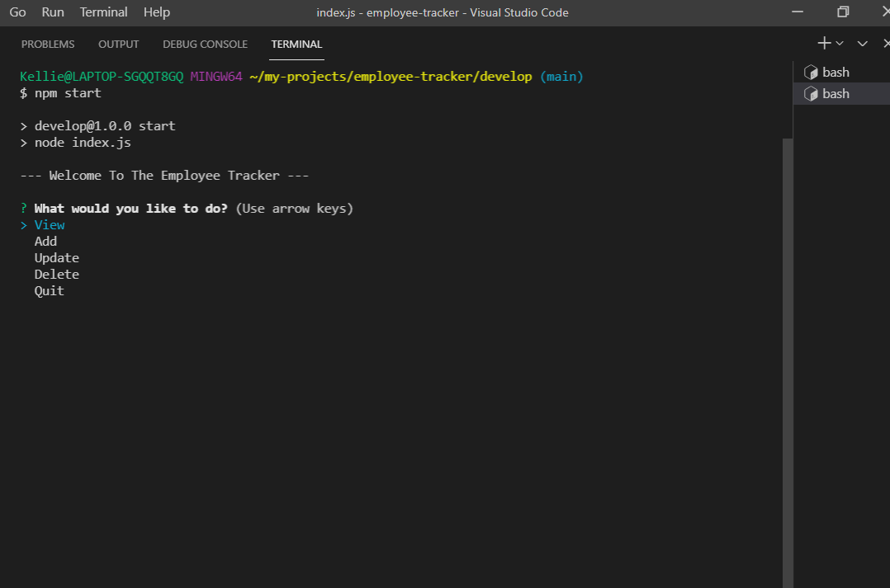
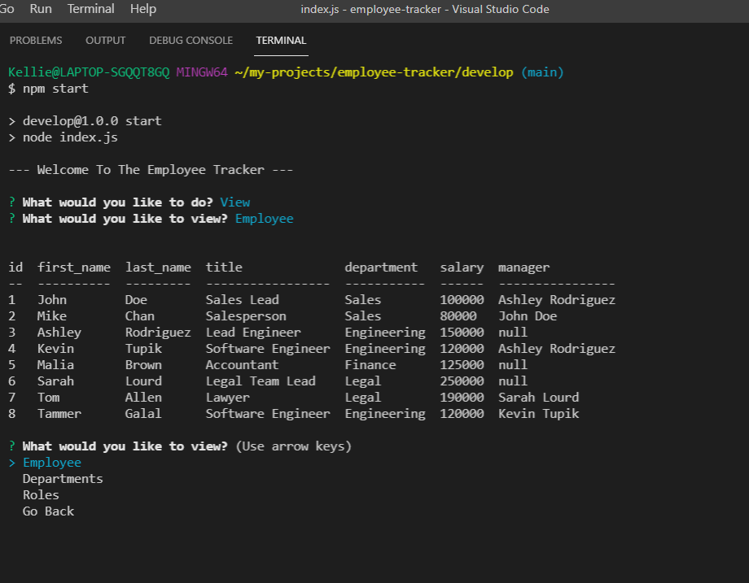

# Employee Tracker

## Table of Contents

- [Description](#description)
- [Installation](#installation)
- [Usage](#usage)
- [Links](#links)
- [Screenshots](#screenshots)

## Description

A handy database tool to manage an Employee Database!

This app uses: 
* Inquirer
* MYSQL
* Console.Table
* DotEnv

## Installation

* Clone the Repository
* Open up and login into MYSQL App and copy the text in the SQL file to your MYSQL terminal to create the Database and Tables needed (this also adds some data, which you can ommit when selecting!)
* Update .env.EXAMPLE with your own database server password and user name (usually "root" for MYSQL) and then save and rename the file to .env
* Open up your terminal and change into the cloned folder
* Type "npm i" to install the dependancies
* Type "npm start' to start the App!

## Usage

This App is not a live site therefore the below video will show how to run and use it!

[Video Link!](https://drive.google.com/file/d/1acD3tV-zqADi3iSu4lCs_boSEpM7PXsW/view?usp=sharing)

## Links

https://github.com/Kel03-byte/employee-tracker

## Screenshots

Screenshot of the Terminal at the Beginning!

Veiwing All Employees!

